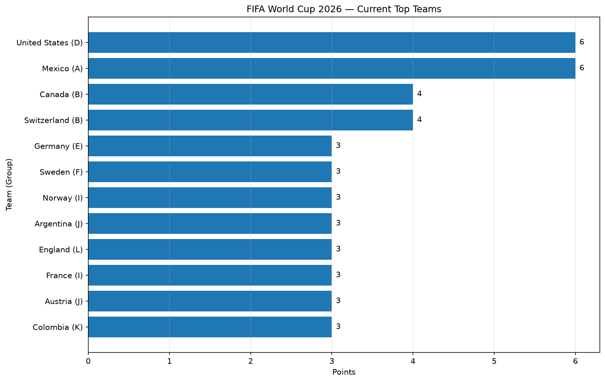

# FIFA World Cup 2026 Streaming Analytics

This project demonstrates a complete Kafka streaming analytics pipeline using
completed FIFA World Cup 2026 match results.

The original example processed sales transactions. My custom project applies
the same streaming techniques to international football match data.

The producer reads completed matches from a CSV file and sends them to Kafka
one record at a time. The consumer validates each match, calculates derived
fields, updates team statistics and group standings, writes output files,
stores the results in DuckDB, and generates a visualization.

## Project Overview

The pipeline follows this workflow:

```text
World Cup CSV
      ↓
Kafka Producer
      ↓
Kafka Topic
      ↓
Kafka Consumer
      ↓
Validation and Analytics
      ↓
CSV + DuckDB + Visualization
```

The project analyzes:

* matches played
* wins, draws, and losses
* goals scored and conceded
* goal difference
* points
* winning percentage
* current group rankings

## Key Visualization

The following chart shows the leading teams based on the matches processed by
the Kafka consumer.



## Output Files

The completed pipeline generates the following artifacts:

* `data/output/consumed_world_cup_matches.csv`
* `data/output/world_cup_team_standings.csv`
* `data/output/world_cup.duckdb`
* `data/output/world_cup_team_standings.png`

## Custom Project

### Dataset

The Kafka producer uses the dataset:

```text
data/world_cup_matches.csv
```

The file contains 29 completed FIFA World Cup 2026 matches available at the
dataset cutoff time.

Each row represents one completed match and includes fields such as:

* `match_id`
* `match_date`
* `stage`
* `matchday`
* `group`
* `home_team_code`
* `home_team`
* `away_team_code`
* `away_team`
* `home_goals`
* `away_goals`
* `winner`
* `result_type`
* `total_goals`
* `home_points`
* `away_points`
* `fifa_venue_name`
* `common_stadium_name`
* `city`
* `host_country`
* `source_url`
* `dataset_cutoff`

The dataset was created from completed World Cup match results published on
the official FIFA scores and fixtures page.

I replaced the original sales dataset with a new football dataset. The sales,
product, currency, discount, and regional fields are not used by the custom
producer or consumer.

### Reproducibility Note

This project uses a fixed CSV snapshot rather than a live FIFA API connection.
The results reflect the completed matches available at the value recorded in
the `dataset_cutoff` field.

Using a fixed snapshot makes the project reproducible. Running the producer
with the same CSV file should generate the same 29 Kafka messages and the same
final standings.

To analyze additional matches, update `data/world_cup_matches.csv` while
preserving the required columns and unique match IDs.

### Kafka Messages

The custom producer is:

```text
src/streaming/kafka_producer_sabri.py
```

The producer reads one completed match at a time from
`world_cup_matches.csv`, validates the record, and sends it to Kafka as a
dictionary message.

The Kafka topic is:

```text
streaming-06-scenarios-case
```

The message key is the World Cup group letter, such as `A`, `B`, or `J`.
Using the group as the key keeps matches from the same group logically
associated.

The message fields were completely changed from the original sales example.
Instead of sending order IDs, products, regions, quantities, and prices, the
producer sends teams, scores, match information, points, venue information,
and result fields.

The producer also checks:

* required fields
* valid ISO dates
* nonnegative goal values
* correct total-goal calculations
* correct winner values
* correct result types
* correct points
* duplicate match IDs

Invalid records are written to:

```text
data/output/producer_rejected_world_cup_matches.csv
```

During the successful run, the producer sent 29 messages and rejected zero
records.

### Consumer Processing

The custom consumer is:

```text
src/streaming/kafka_consumer_sabri.py
```

The consumer receives completed World Cup match messages from Kafka and reads
the topic from the beginning.

For each message, the consumer:

1. validates all required match fields
2. converts numeric fields to integers
3. creates a readable scoreline
4. calculates the winning margin
5. identifies whether the match was a draw
6. updates statistics for both teams
7. recalculates group rankings
8. updates the visualization
9. writes the processed match to CSV
10. writes the match and standings to DuckDB

The consumer calculates these statistics for every team:

* matches played
* wins
* draws
* losses
* goals for
* goals against
* goal difference
* points
* win percentage
* position within the group

The consumer logs information such as:

* match scoreline
* group
* winner
* goals in the match
* number of consumed messages
* total goals
* average goals per match
* home wins
* away wins
* draws
* current group leaders

The consumer processed 29 valid match messages and skipped zero messages.

Processed match records are written to:

```text
data/output/consumed_world_cup_matches.csv
```

Updated team rankings are written to:

```text
data/output/world_cup_team_standings.csv
```

The consumer stores two tables in `world_cup.duckdb`:

* `matches`
* `team_standings`

### Experiments

#### Phase 4 Modification

For Phase 4, I replaced the original high-value sales detection logic with
World Cup match validation and football analytics.

The original project calculated sales totals and identified orders worth at
least $150. My modification changed the producer and consumer to work with
football results instead.

I added validation rules that verify the relationship between:

* home and away goals
* winner
* result type
* total goals
* points awarded

This modification ensures that inconsistent match results are rejected before
they are included in the analytics.

#### Phase 5 Application

For Phase 5, I developed a live team standings application.

After every consumed match, the application updates statistics for both teams
and recalculates their group positions.

Teams are ranked using:

1. points
2. goal difference
3. goals scored
4. team name as a final deterministic tie breaker

The application writes current standings to CSV and DuckDB and updates a
horizontal bar chart showing leading teams.

This transformed the example from a sales-processing pipeline into a complete
sports analytics application.

### Results

The producer successfully sent:

```text
29 completed match messages
```

The producer rejected:

```text
0 messages
```

The consumer successfully consumed:

```text
29 completed match messages
```

The consumer skipped:

```text
0 messages
```

The resulting standings contain 48 national teams across 12 groups.

Examples of findings from the processed matches include:

| Finding                      | Result |
| ---------------------------- | -----: |
| Mexico points                |      6 |
| United States points         |      6 |
| Canada goals scored          |      7 |
| Germany goals scored         |      7 |
| Canada goal difference       |     +6 |
| Germany goal difference      |     +6 |
| Mexico win percentage        |   100% |
| United States win percentage |   100% |

Mexico led Group A with two wins from two matches. The United States led Group
D with two wins. Canada and Switzerland both earned four points in Group B,
with Canada ranked first because of its stronger goal difference.

### Interpretation

The original example streamed sales transactions and calculated financial
values. My version streams football match results and calculates competitive
performance statistics.

Watching the messages move through Kafka demonstrated how a completed sporting
event can become an individual streaming message. The consumer does not need
to wait for the entire dataset before producing insights. After every match,
the rankings, statistics, database, CSV output, and chart can be updated.

This workflow could help a sports organization, broadcaster, analyst, or
tournament operator monitor:

* team performance
* group leaders
* scoring strength
* defensive performance
* qualification position
* changes in standings after each match

The consumed messages provided business intelligence by converting individual
match results into structured tournament-level insights. Instead of examining
each score manually, users can immediately compare teams and identify leaders,
top-scoring teams, strong defenses, and teams at risk of elimination.

## How to Run the Project

Start Kafka and create the project topic before running the Python files.

Run the custom producer:

```shell
uv run python -m streaming.kafka_producer_sabri
```

Run the custom consumer:

```shell
uv run python -m streaming.kafka_consumer_sabri
```

Run the quality checks:

```shell
uv run ruff format .
uv run ruff check . --fix
uv run python -m pyright
uv run python -m pytest
uv run python -m zensical build
```

## Project Documentation Pages

* **Home** - project overview, results, and interpretation
* **Project Instructions** - module-specific instructions
* **Your Files** - guidance for creating custom project files
* **Glossary** - streaming data concepts
* **API** - autogenerated code documentation
